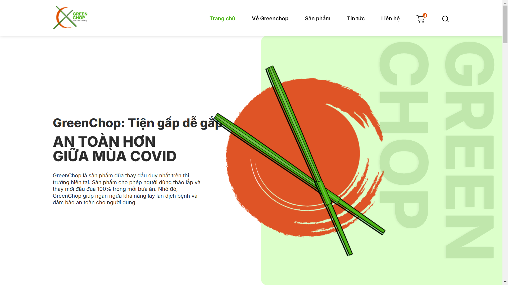
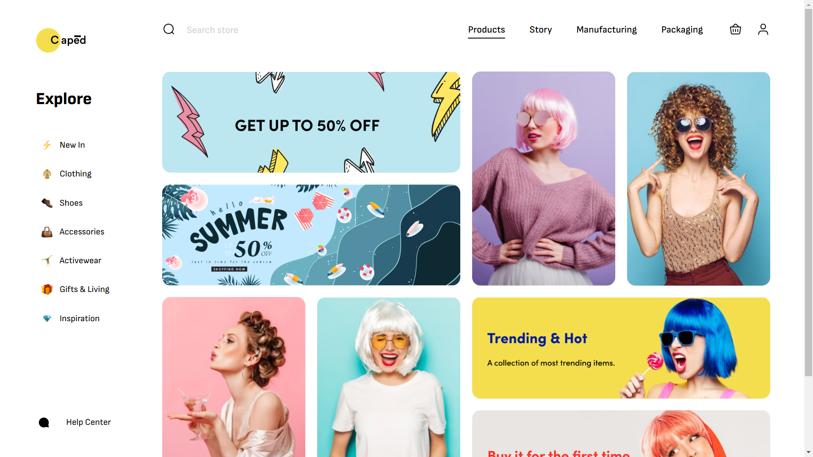
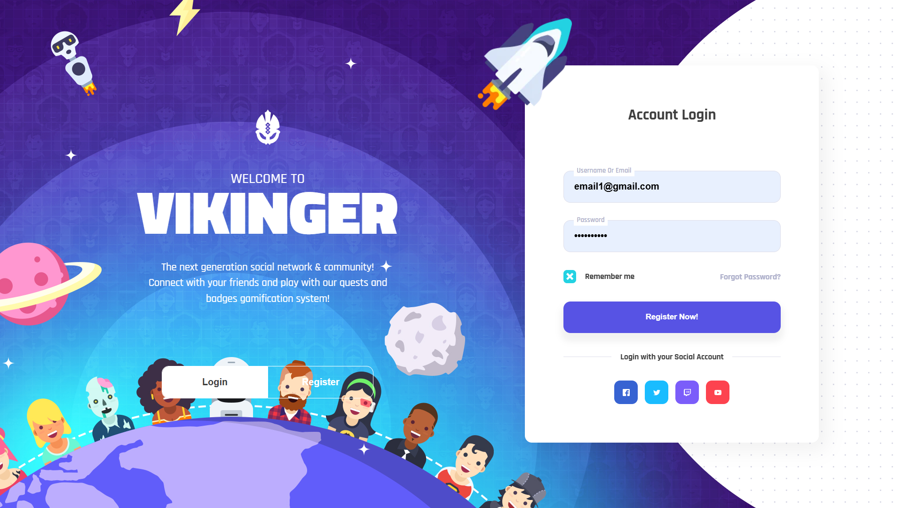
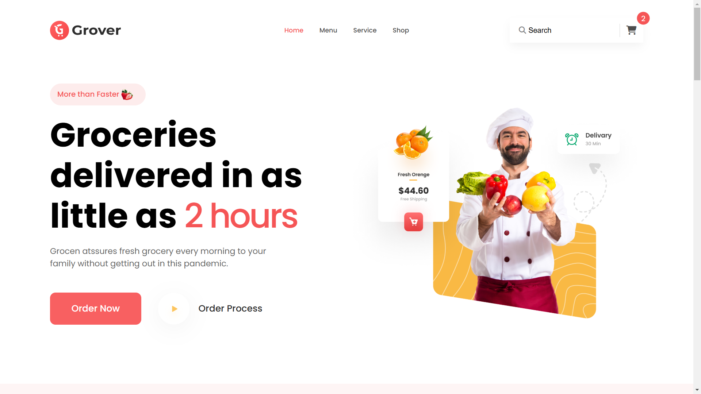

# Học HTML + CSS căn bản

# Các sản phẩm nổi bật 

## 1. GreenChop

- Code giao diện Web tĩnh `trang web bán đồ ăn GREEN CHOP`
- Bài làm hoàn thiện phần trang chủ dựa trên bản thiết kế từ Figma
- Tích hợp thêm sử dụng SCSS. Giúp tăng hiệu suất, khả năng đọc và mở rộng trong tương lai
- Tích hợp đầy đủ Responsive như một sản phẩm thực tế

- Demo: [Link](https://buiduong2.github.io/F8-offline/day16/index.html)
- Source Code: [Link](./day16/)

## 2. Caped:

- Một Trang web bán hàng về `Thời Trang Phụ Nữ`
- Tập trung vào phong cách đơn giản và tinh tế.
- Sử dụng Grid System để tổ chức nội dung rõ ràng cân đối 
- Có responsive

- Demo: [Link](https://buiduong2.github.io/F8-offline/day15/index.html)
- Source Code: [Link](./day15/)

## 3. VIKINGER

- Là một `Giao diện Form Login & Register` bắt mắt được xây dựng hoàn toàn bằng HTML CSS
- Có nhiều hiệu ứng chuyển đổi mượt mà thông qua sử dụng transition
- Có thể chuyển đổi giữa các Tab Login và Register hoàn toàn bằng `HTML + CSS mô phỏng hành vì chuyển đổi tab của Javascript`

- Demo: [Link](https://buiduong2.github.io/F8-offline/day13/index.html)
- Source Code: [Link](./day13/)

## 4. Grover

- Tiếp tục là một `Page Home của trang web bán đồ ăn`
- Bài học đàu tiên về cách sử dụng Responsive

- Demo: [Link](https://buiduong2.github.io/F8-offline/day11/index.html)
- Source Code: [Link](./day11/)

# MỘt SỐ hình ảnh 

## 1. Green Chop

## 2. Caped

## 3. VIKINGER

## 4. Grover

 